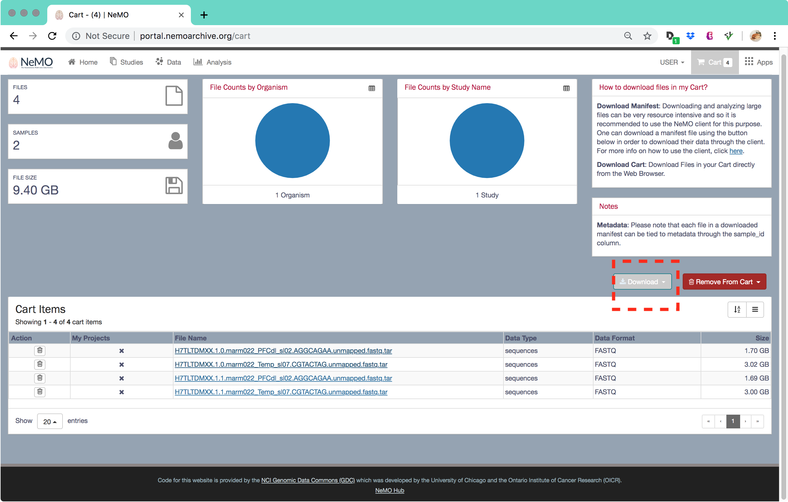
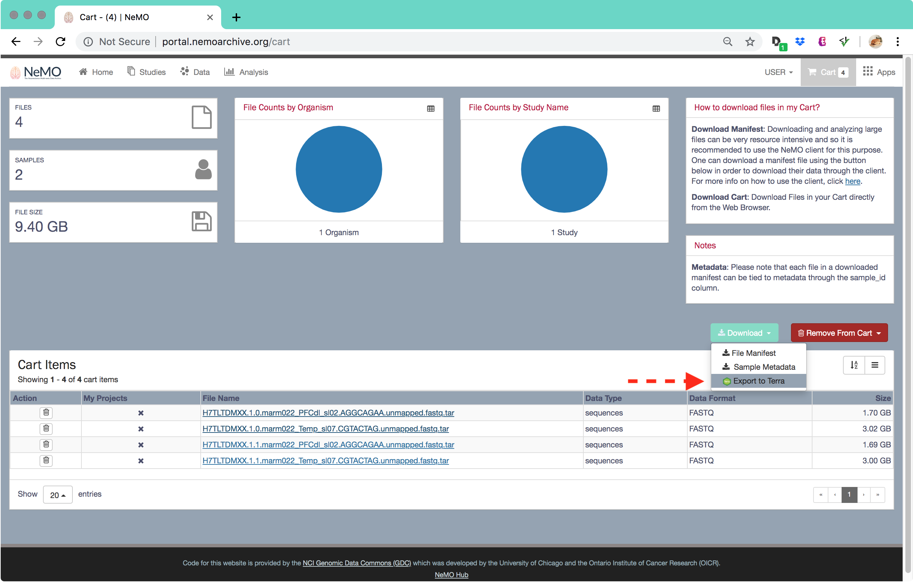
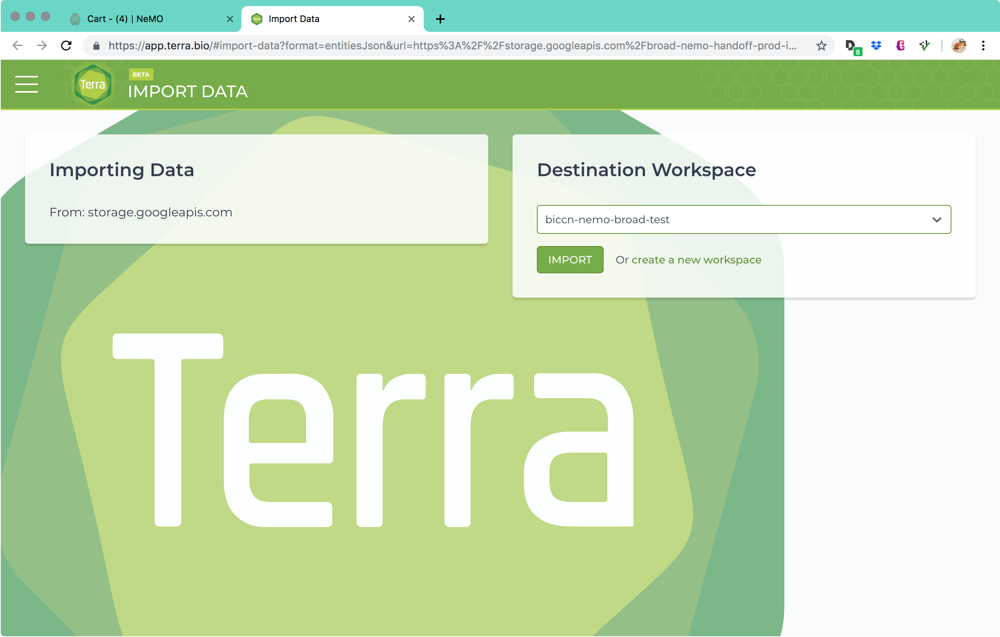
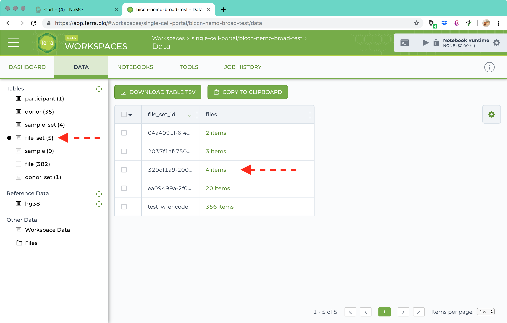

# Summary

This walkthrough teaches you how to export the selected files and metadata from NeMO to be accessible within the Terra data platform.  Terra is a cloud-native platform that allows users to access data from a wide collection of data portals, and use this data in ready-to-use bioinformatics workflows.

To get started with this tutorial, it is recommended that Steps 1 - 3 are followed in the [**Search for Data in the NeMO Portal**](Search-for-Data-in-the-NeMO-Portal) page so that there are files in the Shopping Cart.

For this example we will start with the four files from the shopping cart as picture below.

In order to start the process of exporting the file and sample metadata to Terra, click the "Download" dropdown button, and then select "Export to Terra" (see image below).  Depending on the amount of data to export, this can take some time as the metadata has to be converted and copied over to a storage area on Terra.

After the metadata has been converted and copied, a new window should pop up from Terra.  If the user is not logged into Terra using an existing Google account, the site will ask the user to log in first.  Once it is confirmed the user is logged in, the user will be redirected where he/she will be asked to either select an existing destination workspace or create a new workspace (see image below).

Once the workspace destination is selected, click "Import".  The user will then be redirected to his or her dashboard for this given workspace.  Both the file and sample metadata should now be available to use with Terra's various services and workflows.  In the picture below, if the "File Set" table is corrected, there will be file_set_id entry with 4 files associated.

[top](#top)
